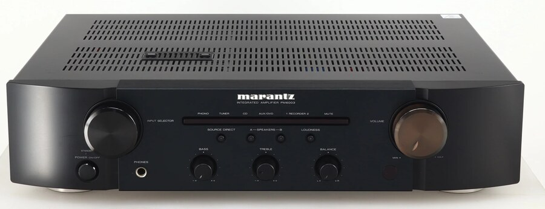
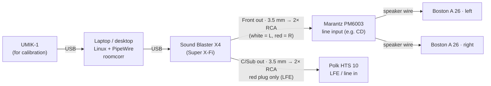

# roomcorr

**Room correction and subwoofer bass management for your laptop or desktop. It makes a pair of desktop speakers sound like a $10,000 system.**

No AV receiver needed. roomcorr does on your Linux computer what a high-end
AV receiver with Dirac Live does: you measure the room with a calibration
microphone, it builds correction filters, and it hands the bass to your
subwoofer with a proper crossover. It all runs on PipeWire, so every app
benefits, and a studio app lets you watch it work live.


## My setup (example)

<table>
<tr>
<td align="center" width="20%"><a href="https://en.creative.com/p/sound-blaster/sound-blaster-x4"></a><br><b>Creative Sound Blaster X4</b><br><sub>USB DAC (Super X-Fi) with 7.1 analog outputs</sub></td>
<td align="center" width="20%"><br><b>Marantz PM6003</b><br><sub>Integrated stereo amplifier</sub></td>
<td align="center" width="20%"><a href="https://www.crutchfield.com/p_065A26B/Boston-Acoustics-A-26.html"></a><br><b>Boston Acoustics A 26</b><br><sub>2-way bookshelf speakers</sub></td>
<td align="center" width="20%"><a href="https://www.polkaudio.com/en-us/product/archive/archive-subwoofers/hts-10/112606.html"></a><br><b>Polk Audio HTS 10</b><br><sub>10" powered subwoofer</sub></td>
<td align="center" width="20%"><a href="https://www.minidsp.com/products/acoustic-measurement/umik-1"></a><br><b>miniDSP UMIK-1</b><br><sub>Calibrated USB measurement mic</sub></td>
</tr>
</table>

<sub>Product photos belong to their manufacturers and retailers (Creative, Kellards, Polk Audio, Willys-Hifi) and link to the product pages.</sub>

### Connections



| From (Sound Blaster X4, back) | Cable | To |
|---|---|---|
| **Front** 3.5 mm out | 3.5 mm → 2× RCA | Marantz line input (CD/AUX): white → L, red → R |
| **C/Sub** 3.5 mm out | 3.5 mm → 2× RCA | **Red** plug → subwoofer LFE/line input. White plug unused. |
| USB | USB | Computer |
| Marantz speaker terminals | Speaker wire | Left and right bookshelf speakers |
| UMIK-1 | USB | Computer (only while calibrating) |

The C/Sub jack carries two channels: centre on the tip (white plug) and LFE on
the ring (red plug). roomcorr sends the sub signal to the LFE channel, which is
the red plug. The calibration also tests both wires and uses whichever one your
sub is actually connected to.

### The gear is an example, not a requirement

What you actually need:

- **A Linux computer with PipeWire.** A laptop or desktop is fine; the engine uses about 1% of one CPU core.
- **An audio interface with a separate output for the subwoofer.** This is the one hard
  requirement: the sub needs its own channel so roomcorr can route bass to it.
  Any USB or internal sound card with a 5.1 (or 2.1) analog output works: front
  L/R to the amp, centre/LFE to the sub. That includes many motherboards' green/orange jacks.
- **Any stereo amplifier or powered speakers** for the mains.
- **Any powered subwoofer** with an RCA line or LFE input.
- **A calibrated USB measurement mic** (miniDSP UMIK-1/UMIK-2 or similar) with its calibration file.

`roomcorr setup` configures the Sound Blaster X4 automatically. With another
interface, switch its profile to *Analog Surround 5.1* (e.g. in pavucontrol)
and set `output_device` in `~/.config/roomcorr/config.json` to that sink's
name (`pactl list short sinks`). For a mic other than the UMIK, set `mic_match`
to part of its name.

## What it does

- **Room correction.** Log-sweep measurements at several mic positions become
  262,144-tap minimum-phase FIR filters aimed at the **Harman in-room target**.
  The deep bass (room modes) is fully corrected; above ~250 Hz only broad, gentle
  corrections are made, so the speakers keep their natural voice (Toole's
  research, and the reason Dirac's ART stays below 150 Hz).
- **Bass management.** A Linkwitz-Riley crossover (60–120 Hz, auto-chosen for
  your room) sends the bass of both channels, plus the LFE channel of 5.1 movies
  and games at +10 dB, to the subwoofer. Your small speakers stop straining and
  the sub does what it's good at.
- **Sub integration.** Sub delay, polarity and level are optimized so the sub and
  speakers add up through the crossover instead of cancelling, then the combined
  bass at your seat is corrected jointly (Dirac Bass Control's idea).
- **Live sub level.** A continuous meter tells you to turn the sub's knob up or
  down, and by how many dB, until it's in the green zone.
- **Verification.** It measures the corrected system and shows measured vs
  predicted vs target.
- **Fast, native engine.** C++20, two-stage partitioned convolution with AVX-512:
  about 1% of one core while playing, nothing when silent, 5 ms of added latency.

## DSP efficiency

Three 262,144-tap correction filters (5.5 seconds each, 0.18 Hz resolution) would
be a heavy load if convolved naively. roomcorr keeps the cost to about **1% of one CPU core**:

| Measured on a Ryzen Threadripper 7980X, real-time paced (`build/roomcorr_bench`) | Audio thread | Worker threads | Total |
|---|---|---|---|
| Playing music | 0.8% | 0.5% | **1.3% of one core** |
| Silence (after ~6 s) | 0.2% | 0% | **0.2%** |
| Earlier single-stage version, playing | 3.5% (5–15% live) | — | 3.5–15% |

How:

- **Two-stage partitioned convolution.** The first 16,384 taps of each filter
  run on PipeWire's realtime thread in 256-sample FFT partitions (5.3 ms of
  latency). The long tail runs on a worker thread in 8,192-sample partitions,
  which is about 30× fewer multiplies per sample for that part of the filter. Because the tail starts two
  blocks into the filter, the worker has a full 170 ms of slack for each block,
  so the audio thread never waits for it. The output is identical to one big
  convolution.
- **AVX-512.** The frequency-domain multiply-accumulate is written so the
  compiler vectorizes it with 512-bit instructions; FFTs use FFTW.
- **Idle skip.** When a channel's input has been silent longer than its filter's
  memory, it clears its state once and does no work until sound returns.
- **No slow paths.** Denormal floats are flushed to zero, filter swaps are
  lock-free with a crossfade, and the audio thread never allocates memory or blocks.

The engine reports its load, idle channels and any late worker blocks (always 0
so far) in the Studio's Engine panel, so you can check this on your own machine.
Since the cost is per core and this small, a laptop has plenty of headroom too.

## Room Correction Studio

| Response vs target | Time & phase alignment |
|---|---|
|  |  |

| Guided calibration | Omarchy bar panel |
|---|---|
|  |  |

## Quick start

```sh
./install.sh               # build + test, install engine, service, Studio, Omarchy plugin
roomcorr setup             # once: sound card to 5.1, "Room Correction" becomes the default output
roomcorr studio calibrate  # set levels (below), then measure (5 mic positions recommended)
```

### Setting levels before calibrating (gain staging)

Getting the levels right once makes everything after it simple: one volume
control, no clipping, and a sub that stays balanced with the speakers.

1. **Sound card.** Set the sound card's own output level once (e.g. 100%, or
   wherever it is now) and leave it there. roomcorr takes over its volume control.
2. **Amplifier.** Turn on *Source Direct* (or set bass/treble flat) and turn
   *Loudness* off, with balance centred. Play some music through Room Correction
   at about 80% and set the amp's volume knob so that is a loud-but-comfortable
   level. **Mark that knob position.** The calibration assumes it stays there:
   the amp changes only the speakers, not the sub, so moving it later upsets the
   speaker/sub balance.
3. **Subwoofer.** Set the low-pass knob to maximum (or use the LFE input so it's
   bypassed) and phase to 0°. roomcorr does the crossover and polarity. Then run
   **Adjust sub level only** in the Studio (or `roomcorr sublevel`) and turn the
   sub's volume knob until the meter is in the green zone.
4. **Calibrate**, then **Verify**, from the Studio.
5. **From now on use only the Room Correction volume** (keyboard volume keys,
   the bar widget, or the Studio). roomcorr leaves some automatic headroom so its
   filters can never clip, and a limiter catches anything that still would.
6. *(Optional)* For even playback between tracks and apps, turn on loudness
   normalization in your players or streaming apps (ReplayGain, "normalize
   volume"). Then the level you set in step 2 suits everything you play.

### Commands

| Command | |
|---|---|
| `roomcorr studio [live\|response\|alignment\|calibrate]` | open the Studio |
| `roomcorr calibrate` | terminal calibration wizard |
| `roomcorr sublevel` | live subwoofer knob adjustment |
| `roomcorr verify` | measure the corrected system |
| `roomcorr design` | rebuild filters from saved measurements (e.g. a new target curve) |
| `roomcorr ctl set sub_gain_db=2 crossover_hz=90` | change settings live |

Build requirements: CMake, a C++20 compiler, FFTW3, libsndfile, PipeWire
headers. Quickshell for the Studio; Omarchy for the bar plugin.

More detail (the calibration method, control protocol, development) is in
[docs/DETAILS.md](docs/DETAILS.md).
