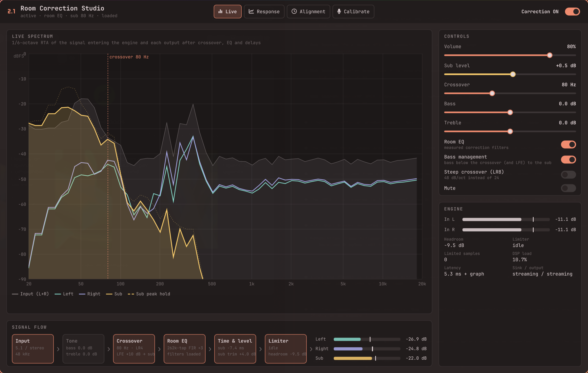
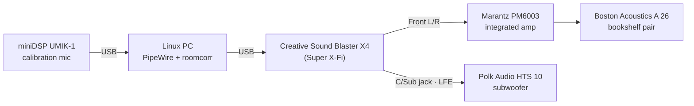
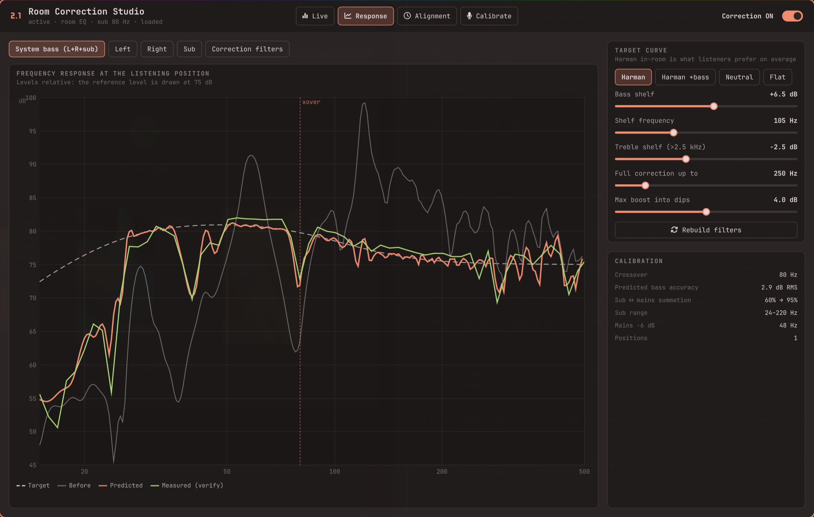
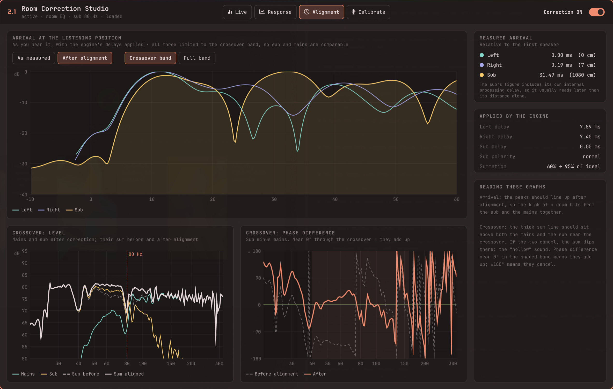
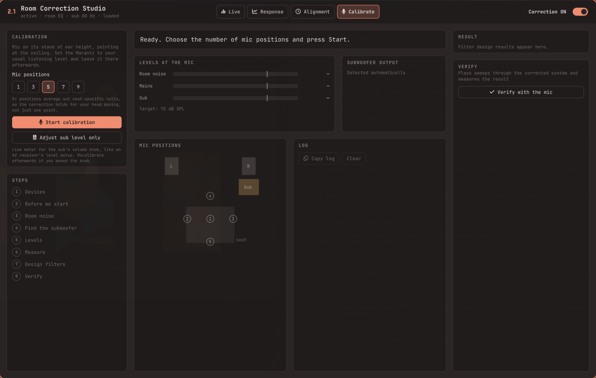
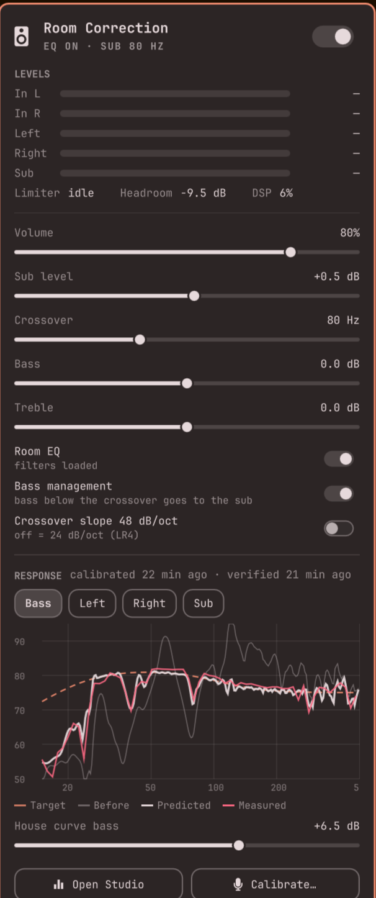

# roomcorr

**Room correction and AV-receiver bass management for Linux. It makes a pair of desktop speakers sound like a $10,000 system.**

A Dirac-style room correction suite for PipeWire. You measure your room with a
calibration microphone, and roomcorr builds correction filters. It also hands the
bass to your subwoofer the way a modern AV receiver does, and gives you a studio
app to watch all of it happen live.



## The setup it was built for



<table>
<tr>
<td align="center" width="20%"><a href="https://en.creative.com/p/sound-blaster/sound-blaster-x4"></a><br><b>Creative Sound Blaster X4</b><br><sub>USB DAC with Super X-Fi, 7.1 outputs</sub></td>
<td align="center" width="20%"><a href="https://www.hifiengine.com/manual_library/marantz/pm6003.shtml"><b>Marantz PM6003</b></a><br><sub>Integrated stereo amplifier<br>(M1 Reference Design)</sub><br><br><sub><i>photo: add your own in <code>docs/gear/</code></i></sub></td>
<td align="center" width="20%"><a href="https://www.crutchfield.com/p_065A26B/Boston-Acoustics-A-26.html"></a><br><b>Boston Acoustics A 26</b><br><sub>2-way bookshelf speakers</sub></td>
<td align="center" width="20%"><a href="https://www.polkaudio.com/en-us/product/archive/archive-subwoofers/hts-10/112606.html"></a><br><b>Polk Audio HTS 10</b><br><sub>10" powered subwoofer</sub></td>
<td align="center" width="20%"><a href="https://www.minidsp.com/products/acoustic-measurement/umik-1"></a><br><b>miniDSP UMIK-1</b><br><sub>Calibrated measurement mic<br>(90° calibration file)</sub></td>
</tr>
</table>

<sub>Product photos belong to their manufacturers and retailers (Creative, Kellards, Polk Audio, Willys-Hifi) and link to the product pages.</sub>

## What it does

- **Room correction.** Log-sweep measurements at several mic positions become
  262,144-tap minimum-phase FIR filters aimed at the **Harman in-room target**.
  The deep bass (room modes) is fully corrected; above ~250 Hz only broad, gentle
  corrections are made, so the speakers keep their natural voice (Toole's research,
  and the reason Dirac's own ART stays below 150 Hz).
- **Bass management like an AV receiver.** A Linkwitz-Riley crossover (60–120 Hz,
  auto-chosen for your room) sends L+R bass, and the 5.1 LFE channel at +10 dB, to
  the sub.
- **Sub integration.** Sub delay, polarity and level are optimized so the sub and
  mains add up through the crossover, followed by a joint correction of the
  combined bass at your seat (Dirac Bass Control's idea).
- **Live sub level.** A continuous meter tells you to turn the sub's knob up or
  down, and by how many dB, until it's in the green zone, like an AVR's level setup.
- **Verification.** It measures the corrected system and shows measured vs predicted
  vs target.
- **Fast, native engine.** C++20, two-stage partitioned convolution with AVX-512:
  the first 16k taps on PipeWire's realtime thread, the long tail on a worker
  thread. Three 262k-tap filters cost about 1% of one core while playing,
  nothing when silent, with 5 ms of added latency.

## Room Correction Studio

| Response vs target | Time & phase alignment |
|---|---|
|  |  |

| Guided calibration | Omarchy bar panel |
|---|---|
|  |  |

## Quick start

```sh
./install.sh               # build + test, install engine, service, Studio, Omarchy plugin
roomcorr setup             # once: X4 to 5.1, "Room Correction" becomes the default output
roomcorr studio calibrate  # measure with the UMIK-1 (5 positions recommended)
```

Then just play music. Use the **Room Correction** volume instead of the amp's knob
from now on, since the calibration assumes the amp stays where it was.

| Command | |
|---|---|
| `roomcorr studio [live\|response\|alignment\|calibrate]` | open the Studio |
| `roomcorr calibrate` | terminal calibration wizard |
| `roomcorr sublevel` | live subwoofer knob adjustment |
| `roomcorr verify` | measure the corrected system |
| `roomcorr design` | rebuild filters from saved measurements (e.g. new target) |
| `roomcorr ctl set sub_gain_db=2 crossover_hz=90` | change settings live |

Requirements: Linux with PipeWire, CMake, a C++20 compiler, FFTW3, libsndfile.
Quickshell for the Studio; Omarchy for the bar plugin.

More detail (the calibration method, protocol, development) is in
[docs/DETAILS.md](docs/DETAILS.md).
